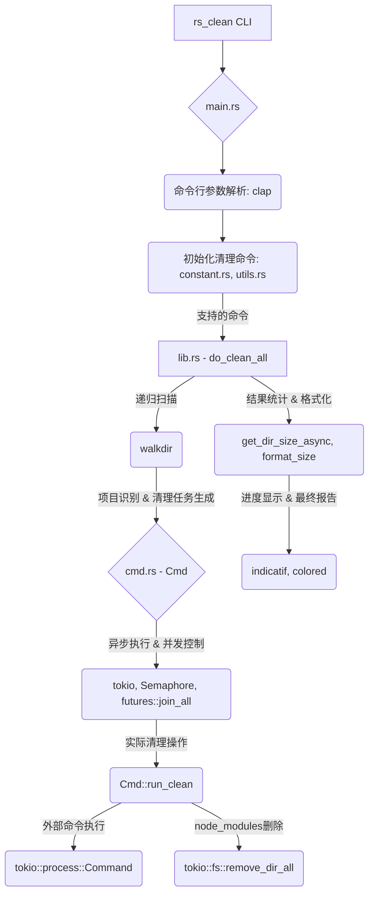

# 🧹 `rs_clean` – Clean Rust/Go/Gradle/Maven Project Targets

> ⚡ 清理 Rust、Go、Gradle、Maven 等项目的构建产物，仅需指定项目根目录。

---

## 🏗️ 架构概览



## 🚀 快速开始

```bash
$ rs_clean folder/
```

🗂 该命令将清除指定 `folder/` 目录及其子目录下的 **Rust 项目的 target 文件夹**，以及其他支持项目（Go、Gradle、Maven）的编译缓存。

您也可以指定要排除的目录名称：
```bash
$ rs_clean folder/ --exclude-dir node_modules --exclude-dir build
```
或者排除某些项目类型：
```bash
$ rs_clean folder/ --exclude-type go --exclude-type maven
```

---

## 📦 安装方式

### 方式 1：使用 Cargo 安装（推荐）

```bash
cargo install rs_clean
```

### 方式 2：从 Release 页面下载可执行文件

👉 [前往 Releases 页面](https://github.com/pwh-pwh/rs_clean/releases) 下载安装适合你系统的版本（如 macOS/Linux/Windows）。

---

## ✨ 功能特性

* ✅ 支持 **Rust** 项目 (`target/`)
* ✅ 支持 **Go** 项目 (`go build` 输出缓存)
* ✅ 支持 **Gradle** 项目 (`build/`)
* ✅ 支持 **Maven** 项目 (`target/`)
* ✅ 支持 **Node.js** 项目 (`node_modules/`，直接删除 `node_modules` 目录)
* ✅ 支持 **Python** 项目 (`__pycache__/`、`venv/`、`.venv/`、`build/`、`dist/`、`.eggs/` 等，直接删除这些目录)
* ✅ **递归扫描子目录**
* ✅ **自动识别项目类型并清理**
* ✅ **高效并行处理:** 利用异步操作和 CPU 核心感知能力，实现快速并发清理。
* ✅ **安全机制:** 包含目录深度和文件数量限制，防止资源过度消耗。
* ✅ **磁盘空间报告:** 清理后显示释放的总磁盘空间。

---

## 📂 示例

```bash
$ tree my_project/
my_project/
├── rust_project/
│   └── target/
├── go_project/
│   └── bin/
├── gradle_project/
│   └── build/
└── maven_project/
    └── target/
```

```bash
$ rs_clean my_project/
```

清理完成后：

```bash
$ tree my_project/
my_project/
├── rust_project/
├── go_project/
├── gradle_project/
└── maven_project/
```

---

## 💡 使用场景

* 项目根目录空间紧张，需要快速释放磁盘。
* CI/CD 脚本中快速清理构建缓存。
* 清理多语言项目的中间文件。

---

## 🛠️ 开发计划

* [ ] 增加交互确认模式
* [ ] 更详细的按项目磁盘空间报告
* [ ] 可自定义的目录/文件排除列表 (部分已通过 `--exclude-dir` 实现)

---

## 🤝 欢迎贡献

欢迎提 Issue、PR 和 Star！🧡
一起让 `rs_clean` 更加好用！
